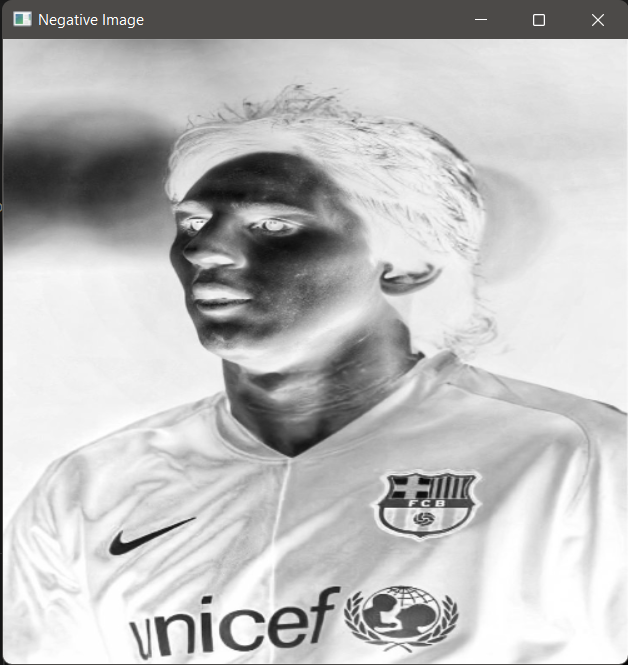
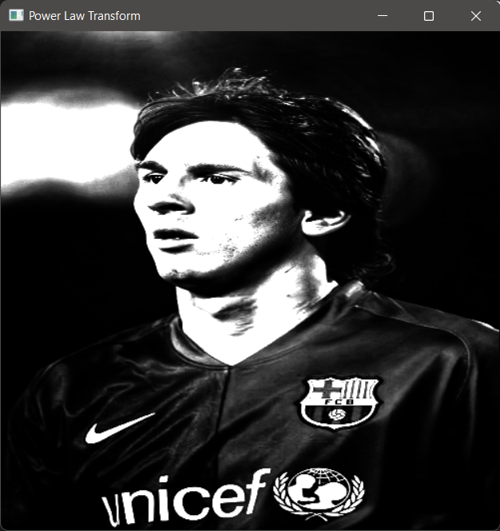
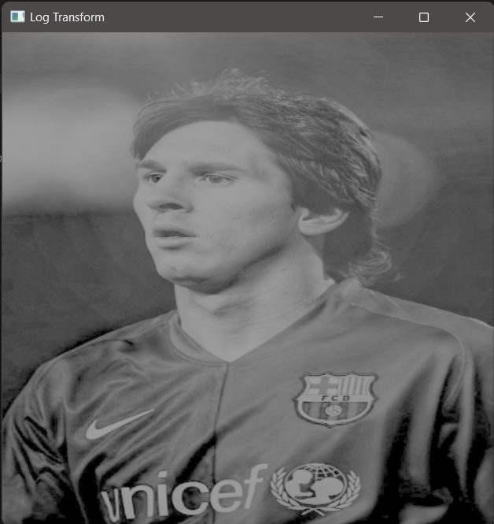
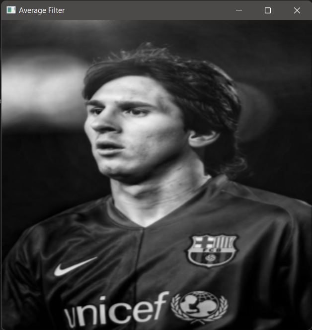
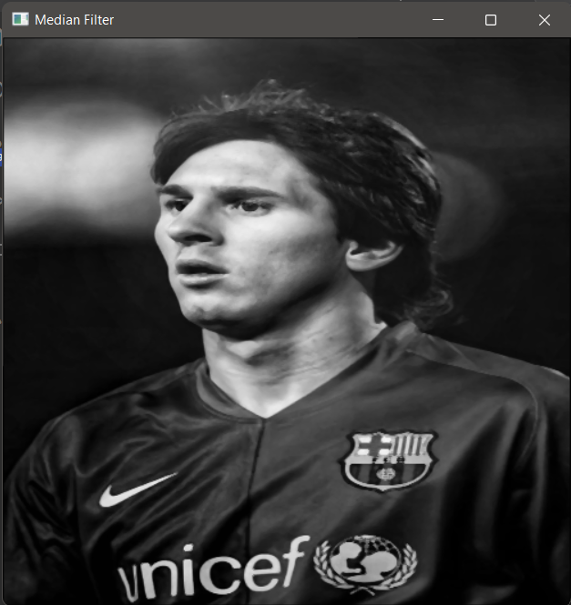
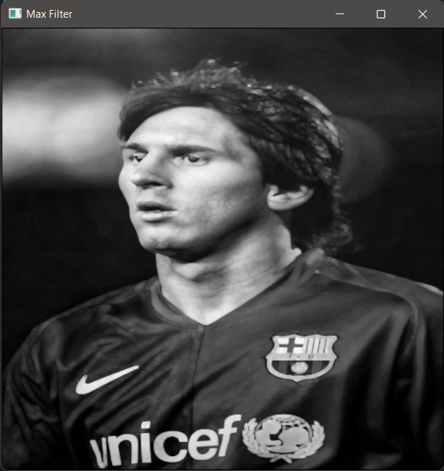
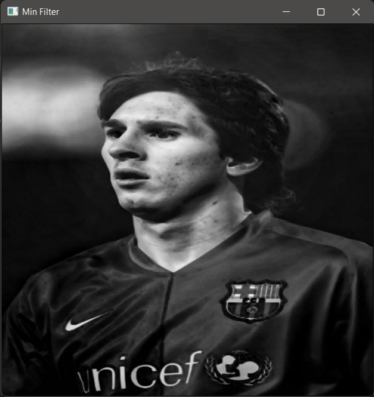

# ImageOps
 Transform your images with this simple yet powerful Python image processing toolkit! 

## ✨ Features

Turn your ordinary images into extraordinary ones with these magical transformations:

- 🌟 **Brightness Control**
  - Brighten up those dark corners
  - Tone down overexposed areas

- 🔄 **Image Negatives**
  - Instant photo negatives
  - Perfect for film-like effects

- 📊 **Advanced Transformations**
  - Power Law (Gamma) Transform: Fine-tune image contrast
  - Logarithmic Transform: Enhance details in dark regions

- 🎯 **Filters**
  - Average Filter: Smooth out noise
  - Median Filter: Remove pesky outliers
  - Max Filter: Enhance bright details
  - Min Filter: Enhance dark details

## 🔧 Requirements
- Python 3.x
- OpenCV (cv2)
- NumPy

## 🚀 Installation

1. Clone this repository:
```bash
git clone https://github.com/AhmedReda85/ImageOps.git
cd ImageOps
```

2. Install required packages:
```bash
pip install opencv-python
pip install numpy
```

## 🎮 How to Use

1. Place your image file (named "image.jpg") in the project directory
(feel free to change the names but don't forget to edit the code)
2. Run the script:
```bash
python main.py
```

3. Choose from the menu options (0-9):
```
Image Processing Menu:
1. Brighten Image
2. Darken Image
3. Negative
4. Power Law
5. Log Transformation
6. Average Filter
7. Median Filter
8. Max Filter
9. Min Filter
0. Exit
```

## 🎯 Tips for Best Results

### Brightness Adjustment
- Values > 1: Increases brightness
- Values < 1: Decreases brightness
- Try values between 0.5 and 2 for nice changes

### Power Law (Gamma) Transform
- γ < 1: Brightens darker regions
- γ > 1: Enhances contrast in bright regions
- Recommended range: 0.3 to 3.0

### Log Transformation
- Great for enhancing detail in dark areas
- Try scaling factors between 1 and 30
- Higher values = stronger enhancement

### Filters
- Average Filter: Best for general noise reduction
- Median Filter: Perfect for removing salt-and-pepper noise
- Max Filter: Highlights bright details
- Min Filter: Highlights dark details


## 💡 Example Usage

```python
# Load and process an image
img = cv2.imread("your_image.jpg", 0)  # Load in grayscale
img = cv2.resize(img, (500, 500))      # Resize to 500x500
img = img / 255                        # Normalize pixel values

# Apply transformations
brightened = more_bright()             # Enter value when prompted
filtered = median_filter()             # No input needed
negative = negative()                  # Instant negative
```

### 📸 Examples & Screenshots

### Original Image


### Brightness Adjustments
| Brightened Image | Darkened Image |
|:---------------:|:--------------:|
|  |  |

### Negative Transform


### Power Law (Gamma) Transform
  |

### Log Transform

*Scaling Factor: 20*

### Filters Comparison
| Filter Type | Result |
|------------|--------|
| Average Filter |  |
| Median Filter |  |
| Max Filter |  |
| Min Filter |  |


## 🤝 Contributing

Found a bug? Want to add a feature? Contributions are welcome! Feel free to:
1. Fork the repository
2. Create your feature branch
3. Send a pull request


# 🎨 Image Processing Toolkit

[... previous content remains the same until the Example Transformations section ...]

